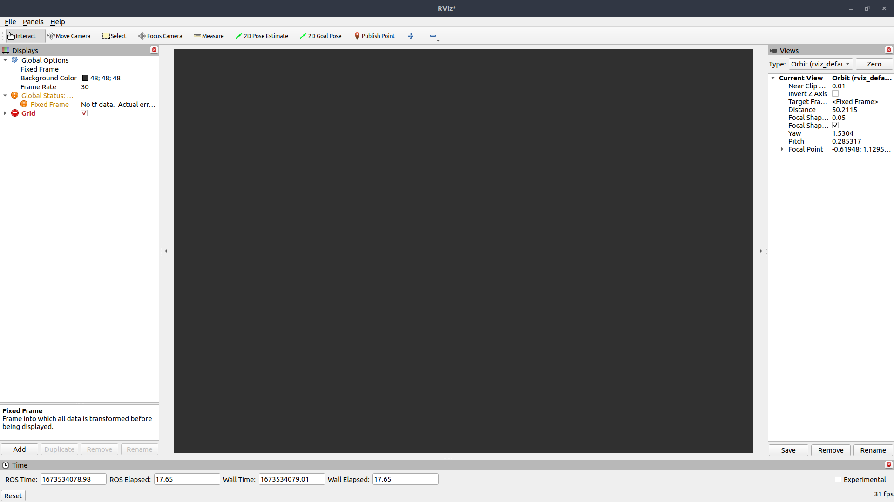
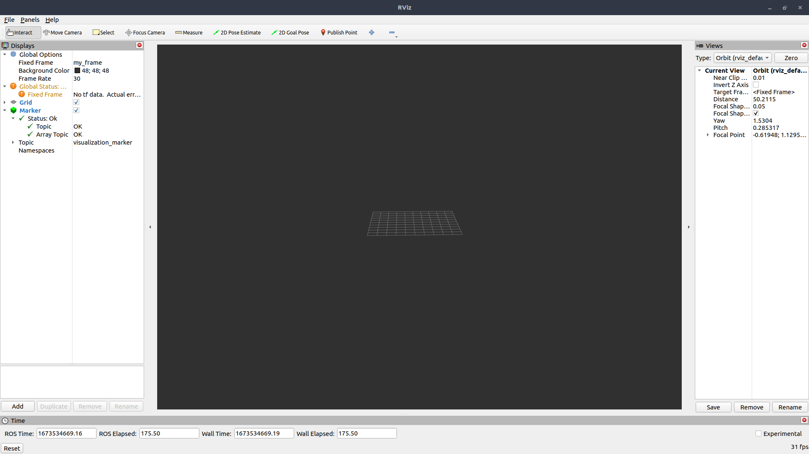

## Table of Contents
1. [Fusion engine driver ros2](#fusion-engine-driver-ros2)
2. [Technologies](#requirements)
3. [Installation](#installation)
<!-- 4. [FAQs](#faqs) -->
<!-- 4. [Collaboration](#collaboration) -->

### Fusion engine driver ros2
***
This project enables developers to use the fusion engine output data in a ROS2 node.
The node will receive from the quectel_runner the the data on the following topics that you can susbcribe to:

* [pose](http://docs.ros.org/en/noetic/api/geometry_msgs/html/msg/PoseStamped.html)
* [gps_fix](http://docs.ros.org/en/hydro/api/gps_common/html/msg/GPSFix.html)
* [fix](http://docs.ros.org/en/melodic/api/sensor_msgs/html/msg/NavSatFix.html)
* [imu](http://docs.ros.org/en/melodic/api/sensor_msgs/html/msg/Imu.html)
* [visualization_marker](http://wiki.ros.org/rviz/DisplayTypes/Marker)

## Requirements
***
A list of technologies used within the project:
* [Quectel](https://cdn.sanity.io/files/2p5fn5cz/production/5fd38edae48d577105acd1393bf918b81c9837e1.pdf)
* [ROS 2](https://docs.ros.org/en/humble/Installation.html)

## Installation
***
In order to install the project you will need to install others technologies.
You will first need to install [Quectel](https://cdn.sanity.io/files/2p5fn5cz/production/5fd38edae48d577105acd1393bf918b81c9837e1.pdf).
Finally, you will also need [ROS 2](https://docs.ros.org/en/humble/Installation.html).

Once these installations are done, you will have to do these actions on 3 different terminals.

* Terminal 1.

In /fusion-engine-client/python folder:

```
$ python3 -m venv venv
$ source venv/bin/activate
$ pip install -r requirements.txt
```

The first time you use ros2 with the gps you may not get any messages you need to set the gps for specific message types. To do this after launching the virtual environment you will need to go in the folder quectel_runner/bin to make the following control. 

```
$ config_tool.py apply uart2_message_rate fe ROSPoseMessage 100ms
$ config_tool.py apply uart2_message_rate fe ROSGPSFixMessage 100ms
$ config_tool.py apply uart2_message_rate fe ROSIMUMessage 100ms
$ config_tool.py save
```

After these commands you should go to the quectel_runner folder:

```
$ pip install -r requirements.txt
$ python3 -m quectel_runner --device-id [YOUR ID] --polaris [YOUR KEY]  -v  --tcp 12345 --output-type=all
```

On this first terminal you must launch the gps on port 12345.

* Terminal 2.

```
$ mkdir ros-fusion-engine
$ git clone https://github.com/PointOneNav/ros2-fusion-engine-driver.git ros-fusion-engine
$ cd ros-fusion-engine
$ colcon build --packages-select fusion-engine-driver                                                            
$ . install/local_setup.bash                                                                                   
$ ros2 run fusion-engine-driver gps
```

* Terminal 3.

```
$ rviz2
```

Initially when you open rviz for the first time you will see this screen:



When you're on rviz you will need to go to the File > Open config tab at the top of the page.
And you will need to go to the rviz2_config folder in the repository and select the file from there.
Once you have added the configuration you will have this screen:


